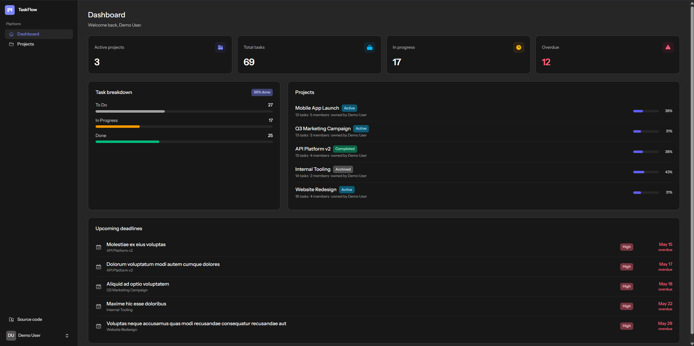
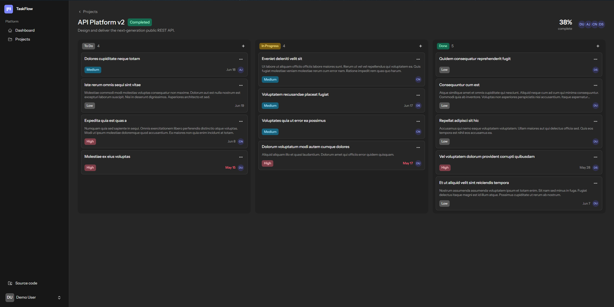
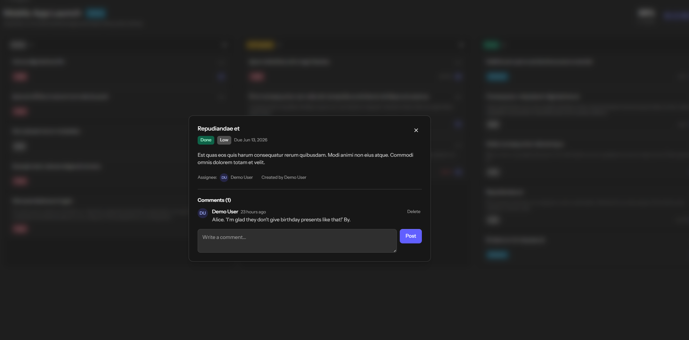
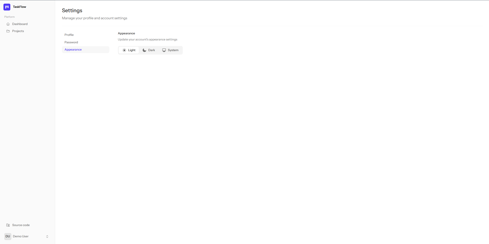

# TaskFlow

A collaborative task-management app with a drag-and-drop Kanban board, built as a modern **Laravel 12 + Livewire 3** monolith.

[](https://github.com/AdolfoSiseG/laravel-task-api-dashboard/actions/workflows/ci.yml)


> **Live demo:** _coming soon_ · **Demo login:** `demo@example.com` / `password` (or just press **“Log in as demo”**)



| Kanban board — drag &amp; drop | Task detail &amp; comments |
| --- | --- |
|  |  |

_Light, dark and system themes (appearance settings):_



---

## Features

- **Projects** — create, edit, archive and delete projects; search and filter; live progress per project.
- **Collaborators** — invite teammates to a project; tasks can only be assigned to members.
- **Kanban board** — three columns (To Do / In Progress / Done) with **drag-and-drop** reordering and moving; a keyboard-accessible “Move to” menu as a fallback.
- **Tasks** — title, description, priority, assignee, due date (with overdue highlighting); completion is timestamped automatically.
- **Comments** — a per-task discussion thread; authors and project owners can moderate.
- **Analytics dashboard** — active projects, task totals, in-progress and overdue counts, a status breakdown with completion rate, project progress bars and upcoming deadlines.
- **Authentication** — register / login (rate-limited), email verification, password reset and account settings.
- **Dark mode** — first-class light / dark / system themes with no flash of the wrong theme.
- **One-click demo** — sign in instantly as a seeded demo user.

## Tech stack

| Layer | Choice |
| --- | --- |
| Backend | Laravel 12, PHP 8.3 |
| Frontend | Livewire 3 + Volt, Alpine.js, Flux UI, Tailwind CSS v4, Vite |
| Database | MySQL 8 (SQLite-friendly for local/tests) |
| Quality | Pest, Larastan (level 6), Laravel Pint, GitHub Actions CI |

## Architecture & quality highlights

- **PHP backed enums** (`ProjectStatus`, `TaskStatus`, `TaskPriority`) as the single source of truth for casts, validation and UI, stored as engine-portable string columns.
- **Authorization via Policies** — owners vs. collaborators are enforced everywhere; cross-tenant access and assigning tasks to non-members are closed off. Sensitive foreign keys are never mass-assignable.
- **Strict Eloquent models** outside production (no lazy loading, no silently discarded attributes), so N+1s and typos fail loudly during development.
- **Static analysis covers the Livewire/Volt components too** — Larastan analyses the single-file components where the CRUD/query/auth logic lives, not just plain classes.
- **Accessible, reusable UI** — a focus-trapping modal component, labelled icon buttons and a drag-and-drop board that still works with the keyboard.
- **50 feature tests** plus Pint and Larastan, all run in CI against a real MySQL service.

## Getting started

**Requirements:** PHP 8.3+, Composer, Node 18+, and MySQL 8 (or use SQLite).

```bash
git clone https://github.com/AdolfoSiseG/laravel-task-api-dashboard.git
cd laravel-task-api-dashboard

composer install
cp .env.example .env
php artisan key:generate

# Configure your database in .env, then:
php artisan migrate --seed

npm install
npm run build
```

Run it locally (serves the app, queue, logs and Vite together):

```bash
composer dev
# or: php artisan serve  +  npm run dev
```

Open <http://localhost:8000> and press **“Log in as demo”**.

> Prefer zero setup? Set `DB_CONNECTION=sqlite` in `.env`, run `touch database/database.sqlite`, then `php artisan migrate --seed`.

## Testing & quality

```bash
composer test       # Pest feature suite
composer lint       # Pint (code style, dry run)
composer analyse    # Larastan (static analysis, level 6)
composer check      # all of the above
```

## Roadmap

- A documented, Sanctum-secured REST API (the domain is already API-ready).
- Real-time board updates (Reverb / Echo).
- Project member management UI and email invitations.

## License

[MIT](LICENSE).
